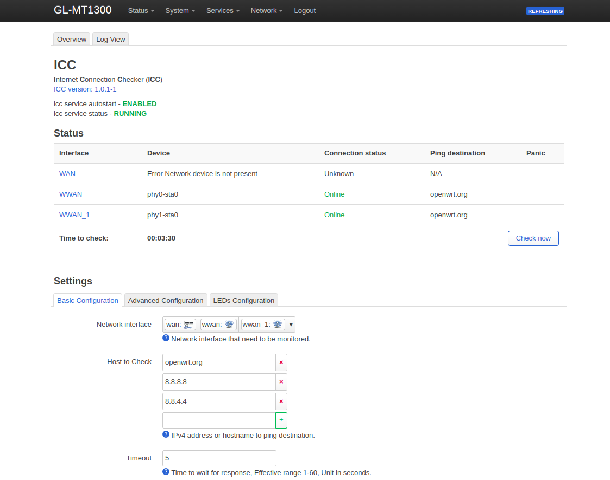
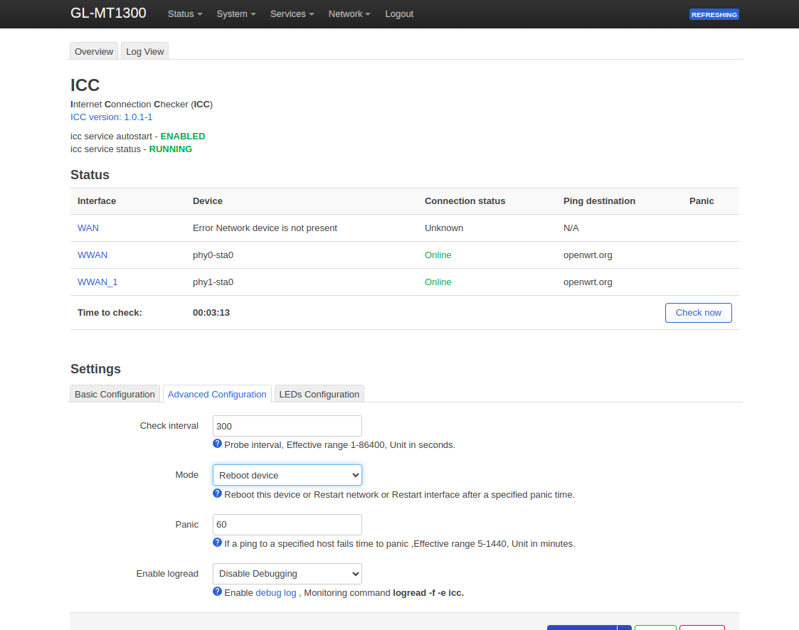

# luci-app-icc & icc
        

### Description
Internet Connection Checker for OpenWrt

### Build From Source

1. Download Openwrt Source Code to build the package.

```shell

git clone https://github.com/openwrt/openwrt
cd openwrt

```

2. Prepare build environment

```shell
./scripts/feeds update -a
./scripts/feeds install -a

git clone https://github.com/Gharib24/icc package/icc
```

3. Choose luci-app-icc as a module or built-in module

```shell
make menuconfig

...

LuCI  --->
    Applications  --->
        <M> luci-app-icc

...

```

4. Build packages

```shell
make package/icc/luci-app-icc/compile V=s
```

## Screenshot 






